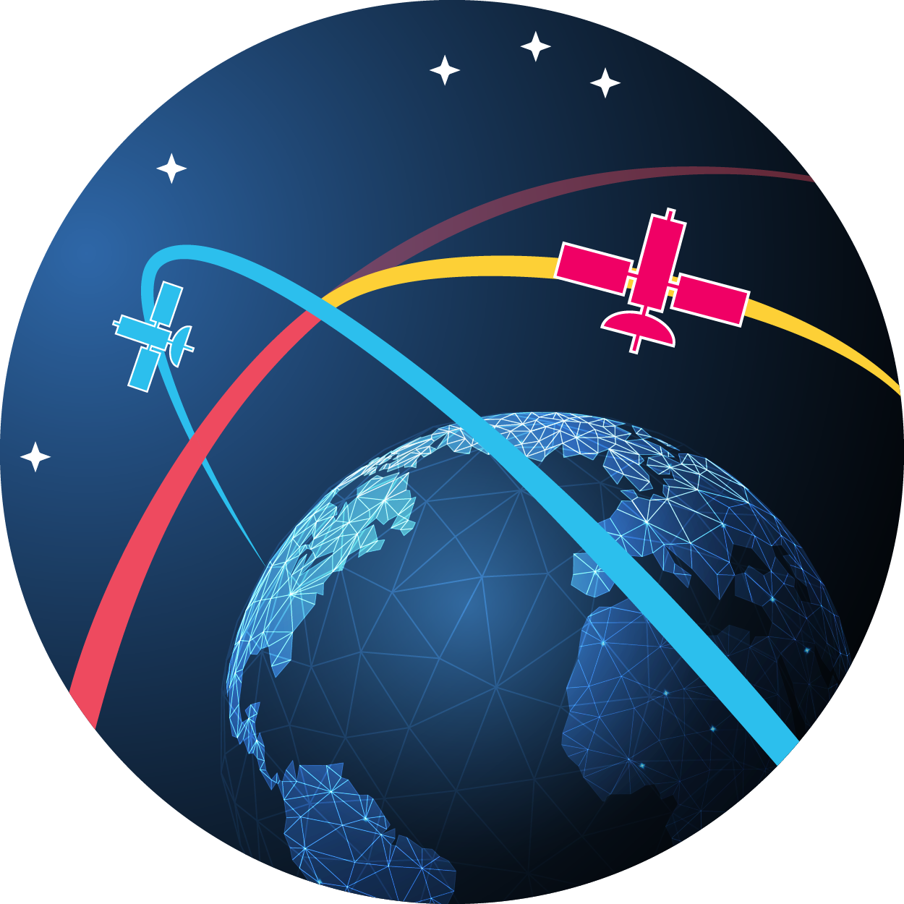

# KSPDG: Kerbal Space Program Differential Games

   

## _Announcement: AIAA SciTech 2024 KSPDG Challenge_ 

_Join us at [AIAA SciTech 2024](https://www.aiaa.org/SciTech) for a software design competition where participants develop autonomous agents for maneuvering satellites engaged in non-cooperative space operations._

_Interested teams should sign up at https://www.surveymonkey.com/r/P2SQVF8, then they will be notified of upcoming meetings._

+ Participants will develop agents capable of solving several challenge problems related to non-cooperative space operations, e.g., pursuing an evasive satellite, multi-satellite proximity operations, etc.
+ Participants are encouraged to develop agents using a range of technologies, e.g., reinforcement learning, optimal control, game theoretical techniques, etc.
+ Participants’ agents will be evaluated on a range of metrics, such as time to completion of mission, fuel consumption, relative distances achieved, etc.
+ The participant pool will undergo a series of elimination events and teams with the best performing agents will be invited to present their agents via a live demonstration during a special session at AIAA SciTech in January 2024
+ Monthly meetings will be held in the lead up to SciTech to allow technical exchanges between participants, MIT Lincoln Laboratory developers, and AIAA SciTech organizers. 

There is no cost to participate and membership and/or SciTech registration is not required. 

__Getting Started?__ See our [installation process](#installation) and examples for how to create agents ([here](#example-hello-kspdg) and [here](#example-agent-environment-runner)) and how to [evaluate agents for scoring purposes](#example-agent-environment-evaluator-for-scitech-challenge)

Questions? Contact Ross Allen at: ross [DOT] allen [AT] ll [DOT] mit [DOT] edu 

## KSPDG Overview

This library provides a suite of differential game (DG) challenge problems / environments set in the orbital domain built within the [Kerbal Space Program (KSP)](https://www.kerbalspaceprogram.com/) game engine. The intent of the KSPDG library is to provide benchmark challenge problems for evaluating autonomous control and AI algorithms applied to non-cooperative space operations.

The KSP differential game environments are implemented using the [OpenAI Gym](https://github.com/openai/gym) (or more specifically [Gymnasium](https://gymnasium.farama.org/) which is the drop-in-replacement, maintained fork of Gym) and [PettingZoo](https://pettingzoo.farama.org/) standards. Non-GUI control of the KSP game engine is enabled by [kRPC](https://krpc.github.io/krpc/) and control of physically distant spacecraft is enabled by [PhysicsRangeExtender](https://github.com/jrodrigv/PhysicsRangeExtender).

### Design Principles

+ Differential Games in the Orbital Domain
    + First and foremost, KSPDG defines a set of differential games (e.g. pursuit-evasion) to be solved in the orbital domain. 
+ Standardized API
    + KSPDG uses the [OpenAI Gym](https://github.com/openai/gym) API for agent interactions to provide an industry-standard interface for control algorithms and agents
+ Open Source and Extensible
    + KSPDG is made open source so that the broader community can create new scenarios/environments for benchmarking
+ Evaluation, Not Training
    + KSPDG provides evaluations environments, _NOT_ training environments for reinforcement learning algorithms. There are several reasons for this. 
    + Practically speaking, KSP was not designed for the massively parallel, faster-than-real-time, headless execution typically needed for large-scale RL training. 
    + From a more principled perspective, it can be argued that non-trainable evaluation environments are of vital importance to the RL research community as they act as the true "test set" for which you cannot overfit your agents upon because they cannot be directly trained upon.
    + Furthermore, trainable environments tend to imply that RL is the most effective solution method. We make no such assumption; indeed optimal control techniques and numerical differential game solvers may produce superior results in terms of development time, robustness, and optimality. 
+ Environments, Not Agents
    + Similar to other "gym" libraries, KSPDG only provides environments (aka scenarios, challenge problems), not the agents that solve those environments. Developing agents that best solve the KSPDG environments is work for the broader community.
+ Non-Blocking Step Function
    + In KSPDG, game time does not pause while agents make decisions. This is a defining characteristic of KSPDG as best matches the real world and provides an inherent penalty to decision and control policies that take a long time to compute.

### Environments / Challenge Scenarios

KSPDG is collection of orbital challenge problems defined within different scenario groups (i.e. "evaluation environments" to use nomenclature from reinforcement learning literature). As of Sep 2023, the challenge problems thus far implemented in KSPDG can be grouped into the following types of scenarios

+ Basic [Pursuit-Evasion](https://github.com/mit-ll/spacegym-kspdg/tree/main/src/kspdg/pe1)
+ Multi-agent target guarding, referred to as a [Lady-Bandit-Guard problem](https://github.com/mit-ll/spacegym-kspdg/tree/main/src/kspdg/lbg1)
+ 1-v-1 [Sun-blocking problem](https://github.com/mit-ll/spacegym-kspdg/tree/main/src/kspdg/sb1)

In future development plans include scenarios with features like partial observability, multi-agent inspection problems with vision-based observation spaces, and head-to-head scenarios that leaverage the [Luna Multiplayer mod](http://lunamultiplayer.com/) that allow direct competition between two different AI players (current scenarios involve testing AI against pre-scipted bot adversaries)

------------

## Citation

[](https://zenodo.org/badge/latestdoi/572083084)

```
@inproceedings{allen2023spacegym,
  title={SpaceGym: Discrete and Differential Games in Non-Cooperative Space Operations},
  author={Allen, Ross E and Rachlin, Yaron and Ruprecht, Jessica and Loughran, Sean and Varey, Jacob and Viggh, Herbert},
  booktitle={2023 IEEE Aerospace Conference},
  pages={1--12},
  year={2023},
  organization={IEEE}
}
```

------------

## Disclaimer

DISTRIBUTION STATEMENT A. Approved for public release. Distribution is unlimited.

This material is based upon work supported by the Under Secretary of Defense for Research and Engineering under Air Force Contract No. FA8702-15-D-0001. Any opinions, findings, conclusions or recommendations expressed in this material are those of the author(s) and do not necessarily reflect the views of the Under Secretary of Defense for Research and Engineering.

© 2022 Massachusetts Institute of Technology.

Subject to FAR52.227-11 Patent Rights - Ownership by the contractor (May 2014)

SPDX-License-Identifier: MIT

The software/firmware is provided to you on an As-Is basis

Delivered to the U.S. Government with Unlimited Rights, as defined in DFARS Part 252.227-7013 or 7014 (Feb 2014). Notwithstanding any copyright notice, U.S. Government rights in this work are defined by DFARS 252.227-7013 or DFARS 252.227-7014 as detailed above. Use of this work other than as specifically authorized by the U.S. Government may violate any copyrights that exist in this work.

------------

## Installation

The installation process includes several components:
+ [Kerbal Space Program](https://www.kerbalspaceprogram.com/)
+ [Making History Expansion](https://store.privatedivision.com/game/kerbal-space-program-making-history-expansion-official-pc)
+ [Mission Save Files](https://github.com/mit-ll/spacegym-kspdg/tree/master/ksp_saves/missions)
+ [kRPC Server](https://krpc.github.io/krpc/getting-started.html#the-server-plugin)
+ [PhysicsRangeExtender](https://github.com/jrodrigv/PhysicsRangeExtender)
+ [`kspdg` python package](https://github.com/mit-ll/spacegym-kspdg/tree/master/src/kspdg)
+ [Luna Multiplayer](http://lunamultiplayer.com/) (optional/future work)

> :warning: **Note**
> These instructions have been written and verified on a macOS. They have been partially tested on Ubuntu 18.04 as well. Other operating systems should be similar with deviations on file and directory names


### Install KSP & Making History Expansion

1. Purchase and Download Kerbal Space Program and Making History expansion: https://store.privatedivision.com/game/buy-kerbal-space-program-ksp
    + Make sure to purchase _Direct Download / DRM Free Private Division_ as the platform. Make sure you are buying KSP1 and not the recently released KSP2; none of this will work on KSP2!
    + Download the most recent version of KSP  "On Final Approach" Portable (.zip). As of this writing and testing, the most recent version was v1.12.5
    + Download the most recent version of Making History expansion pack. As of this writing the most recent version was v1.12.1 
2. Unzip `ksp-osx-1.12.5.zip` to desired location; for simplicity, all instructions assume the unzipped KSP folder is placed on the Desktop
3. Attempt to open the KSP game executable/app (e.g. `KSP.app` on Mac)

> :warning: **Troubleshooting**
> + On a Mac, you might run into an error where you can't open the KSP app because the developer can't be verified.
> + To change these preferences on your Mac, choose Apple menu > System Preferences, click Security & Privacy
> + Under the General tab there should be a notification saying something like "KSP.app was blocked ..." if you've attempted to open the KSP app. Click the "Open Anyway" button next to the notification

> :warning: **Troubleshooting**
> + On a Mac, after enabling KSP to be opened in Security and Privacy, you may encounter a bug where [the game loading screen stalls indefinitely](ttps://forum.kerbalspaceprogram.com/index.php?/topic/151986-just-purchased-and-stuck-on-loading-screen-mac-os/)
> + The workaround is to move the `KSP.app` icon onto the desktop and then back into the `KSP_osx` directory. For some reason bash commands didn't seem to work to fix this bug. Had to manually open Finder, drag the KSP.app icon onto the Desktop, and then drag it back into the KSP_osx/ directory

4. Unzip `KSP-Making_History_Expansion-en-us-mac-1.12.1.zip`
5. Follow the instructions in the `Instructions-xxx-xx-xx.txt` file located in the unzipped Making History Expansion directory. 

> Instructions:
> 1. Copy the two other files located in this folder (.command and .zip) to the folder where the KSP app is located
> 2. Once you have copied the files, double click the .command file
> Thats it! Enjoy the Making History Expansion of Kerbal Space Program!

6. Test installation by opening KSP (e.g. KSP.app on Mac). When main screen has loaded, select `Start Game` and you should see options for `Play Missions` and `Mission Builder` to confirm that the Making History Expansion was successfully installed

### Install KSPDG Mission Save Files

For each differential game environment there are associated mission files created using the "Making History" expansion pack that serves to populate the KSP game engine with the necessary spacecraft in the appropriate orbits. There is also a number of mission save files for in-game software development testing purposes.

The save files are located in this repo under `ksp_files/saves/missions` and `ksp_files/Missions`; both sets are necessary to populate the differential game environments. These mission save files must be downloaded and manaully installed into the correct directory of the KSP game installation.

Copy the contents of `ksp_files/saves/missions/` and `ksp_files/Missions` directory into your local installation of KSP. For example, on a Mac with this repo and KSP's install directories on the desktop this would look like:
```bash
git clone git@github.com:mit-ll/spacegym-kspdg.git
cd spacegym-kspdg
cp -r ksp_files/saves/missions/. ~/Desktop/KSP_osx/saves/missions
cp -r ksp_files/Missions/. ~/Desktop/KSP_osx/Missions
```

### Install kRPC Server

kRPC is what allows external scripts and processes (such as python programs) to send commands to and control the KSP game engine
1. Download latest version of kRPC from the [GitHub link on the kRPC Getting Started Page](https://krpc.github.io/krpc/getting-started.html#installation). As of this writing, you should download `krpc-0.5.2.zip`. __NOTE:__ make sure to download a full version, not just the python package; v0.5.2 is a full version but v0.5.3 is just the python package
2. Unzip `krpc-0.5.2/` folder to `~/Desktop/krpc-0.5.2/`
3. Create a new directory in KSP's `GameData` directory and move all of the krpc contents there
```bash
mkdir ~/Desktop/KSP_osx/GameData/kRPC
mv ~/Desktop/krpc-0.5.2/* ~/Desktop/KSP_osx/GameData/kRPC/
```

### Install PhysicsRangeExtender

By default in KSP, high-fidelity physical simulation of spacecraft is only performed for spacecraft very near to the active spacecraft (e.g. only around [2km](https://steamcommunity.com/app/220200/discussions/0/3044985412465032716/)). [PhysicsRangeExtender](https://github.com/jrodrigv/PhysicsRangeExtender) allows for better simulation (e.g. thusting maneuvers) of more distant spacecraft.
1. Clone PhysicsRangeExtender (assumed to be cloned to Desktop in these instructions, but you can put it wherever you like since you will be copying things from the clone to `GameData`)
2. Copy necessary subfolder from PhysicsRangeExtender to your KSP install's `GameData` folder
```bash
# clone PhysicsRange Extender locally
cd ~/Desktop
git clone git@github.com:jrodrigv/PhysicsRangeExtender.git

# copy the necessary game data for the mod into your KSP install
mkdir ~/Desktop/KSP_osx/GameData/PhysicsRangeExtender
cp -r ~/Desktop/PhysicsRangeExtender/PhysicsRangeExtender/Distribution/GameData/PhysicsRangeExtender/* ~/Desktop/KSP_osx/GameData/PhysicsRangeExtender/
```

### Install `kspdg`

If you have not yet done so, clone this repository locally on your machine

```bash
git clone git@github.com:mit-ll/spacegym-kspdg.git
```

To install this package, run:

```bash
cd spacegym-kspdg
pip install -e .
```

For development of this package, we recommend using the conda environment defined in `environment.yml`. To create and activate this environment, run:

```bash
cd spacegym-kspdg
conda env create -f environment.yml
conda activate kspdg
``` 

> :warning: **Troubleshooting**
> + Note that the `kspdg` library depends upon [astropy](https://www.astropy.org/), which in turn depends upon [pyerfa](https://github.com/liberfa/pyerfa)
> + __FOR MAC USERS with M1 chipsets:__ as of this writing, [pyerfa has not fully supported M1's arm64 architecture](https://github.com/liberfa/pyerfa/issues/83)
> + This can lead to errors running `kspdg` such as
> ```
> (mach-o file, but is an incompatible architecture (have 'x86_64', need 'arm64e'))
> ```
> + The workaround for Mac users with M1 chipsets is described [here](https://github.com/liberfa/pyerfa/issues/83#issuecomment-1255333177). For Python 3.9, the workaround entails cloning pyerfa locally, checking out a specific version, and installing in the conda environment
> ```bash
> # get pyerfa source code and switch to specific release of pyerfa
> git clone --recursive https://github.com/liberfa/pyerfa/
> cd pyerfa
> git fetch origin
> git checkout v2.0.0.1
> 
> # install specific version of pyerfa in conda environment
> conda activate kspdg
> pip install .
> ```

### Install Luna Multiplayer (LMP)

_Future Work_

### Verify Installation

__NOTE:__ Because the KSPDG environments are inexorably linked to the KSP game engine, many of the library's unit/integration test can only be run when a particular game mission file has been loaded and running. This means that verifying installation and testing during code development is a bit more involved than just a single `pytest` call

__Serverless Tests:__ Quick test to run without KSP game engine running nor kRPC server connection

```bash
cd spacegym-kspdg
conda activate kspdg
pytest tests/serverless_tests/
```

__KSP In-Game Tests:__ These tests require the KSP game engine to be running, the test-specific mission to be loaded, and a connection to the kRPC server

1. Start KSP game application. 
2. Select `Start Game` > `Play Missions` > `Community Created` > `pe1_i3` > `Continue`
3. In kRPC dialog box click `Add server`. Select `Show advanced settings` and select `Auto-accept new clients`. Then select `Start Server`
4. In a bash terminal:
```bash
cd spacegym-kspdg
conda activate kspdg
pytest tests/ksp_ingame_tests/test_pe1_i3.py

# for additional tests, load a different mission in KSP: 
# ESC > Quit to Main Menu > Exit to Main Menu > Play Missions > `lbg1_i2` > Continue
pytest tests/ksp_ingame_tests/test_lbg1_i2.py

# ESC > Quit to Main Menu > Exit to Main Menu > Play Missions > `sb1_i5` > Continue
pytest tests/ksp_ingame_tests/test_sb1_i5.py
```
5. You should see the KSP game reset and focus on a vehicle that then performs several orientation and propulsive maneuvers. The pytest command should then indicate the number of passed tests.


> :warning: **Troubleshooting**
> If you are using a Mac with an arm64 architecture (e.g. M1 chipset) and recieve an error like `(mach-o file, but is an incompatible architecture (have 'x86_64', need 'arm64e'))`, please refer to instructions in the [kspdg library installation section](#install-kspdg) about installing `pyerfa` from source.

------------

## Example: Hello KSPDG

Here we provide a "hello world" example of implementing a pursuit agent in the simple Pursuit-Evade environment. This agent simply points at the pursuer and burns full throttle (Do you think that can interecept even a non-maneuvering evader? Try it and find out!)

1. Start KSP game application. 
2. Select `Start Game` > `Play Missions` > `Community Created` > `pe1_i3` > `Continue`
3. In kRPC dialog box click `Add server`. Select `Show advanced settings` and select `Auto-accept new clients`. Then select `Start Server`

```python
from kspdg.pe1.e1_envs import PE1_E1_I3_Env

# instantiate and reset the environment to populate game
env = PE1_E1_I3_Env()
env.reset()

# Environment automatically orients pursuer toward target
# therefore a niave pusuit policy to to simply burn at full
# thrust in pursuer's body-forward direction.
# Do this until the episode 
# (Do you think it can intercept even a non-maneuvering evader??)
is_done = False
act = {
    "burn_vec": [1.0, 0, 0, 1.0], # burn vector in x, y, z, and duration [s]
    "vec_type": 0,  # burn vector as throttle values (if =1, burn vector represents thrust in [N])
    "ref_frame": 0  # burn_vec expressed in agent vessel's right-handed body frame. 
                    # i.e. forward throttle, right throttle, down throttle, 
                    # Can also use rhcbci (1) and rhntw (2) ref frames
}
while not is_done:
    obs, rew, is_done, info = env.step(act)

# printout info to see evaluation metrics of episode
print(info)

# close the environments to cleanup any processes
env.close()
```

See [`scripts/example_hello_kspdg.py`](scripts/example_hello_kspdg.py) for more details

------------

## Example: Agent-Environment Runner

Even though KSPDG environments are Gym (Gymnasium) environments, they require special handling because they must manage server connections to the KSP game engine, as well as handle the non-blocking nature of KSPDG environments (i.e. simulation time continues during and between calls to `env.step()`) which requires parallel processes for the environment interactions and agent's policy computation.

Therefore we have defined a Agent-Environment Runner class that helps manage these interactions. Users can define agents by extending the `BaseAgentEnvRunner` and execute their agents as follows

1. Start KSP game application. 
2. Select `Start Game` > `Play Missions` > `Community Created` > `pe1_i3` > `Continue`
3. In kRPC dialog box click `Add server`. Select `Show advanced settings` and select `Auto-accept new clients`. Then select `Start Server`
4. In a terminal, run `python scripts/example_agent_runner.py`

See [`scripts/example_agent_runner.py`](scripts/example_agent_runner.py) for more details

------------

## Example: Agent-Environment Evaluator for SciTech Challenge

This example walks through how to evaluate agents for scoring purpose in the AIAA SciTech 2024 Challenge. Due to the GUI-based interface of KSP that requires manual interaction, there is not a straight-forward process for hosting a centralized evaluation server upon which participants can submit agents. Instead we have adopted a decentralized process where agents are evaluated locally on particapants' own computers. Participants will then upload their evaluation results to a centralized scoreboard where they will be authenticated and ranked against other participants.

> :warning: **Honor System**
> While we have taken some steps to prevent falsification of results, there is still potential for cheating. 
> Therefore this competition works largely on the __honor system__. 
>
> _If you think you are doing something inappropriate or unfair, you probably are._ 
> 
> __We reserve the right to disqualify teams for unsporting behavior__

The agent evaluation process uses a compiled python script located in `evaluation/evaluate.cpython-312.pyc` which takes a command-line argument pointing to a Agent-Env runner configuration file. The configuration file contains several pieces of information, inlcuding:
- user name and pass key for authentication on the public leaderboard
- The kspdg environment that is too be evaluated. 
- path to the user-defined agent to be evaluated, the agent's class name, any input arguments needed to instantiate the agent, and an agent nickname to distinguish it from other agents on the leaderboard that may be instantiated from the agent class (e.g. if the user runs the same agent multiple times or with different input arguements)

See [`evaluation/configs/example_eval_cfg.yaml``](evaluation/configs/example_eval_cfg.yaml) for an example of the config file

Here is a basic example for running an agent-environment evaluation. As with other examples, you begin by:

1. Start KSP game application. 
2. Select `Start Game` > `Play Missions` > `Community Created` > `pe1_i3` > `Continue`
3. In kRPC dialog box click `Add server`. Select `Show advanced settings` and select `Auto-accept new clients`. Then select `Start Server`

```bash
conda activate kspdg # while it is not strictly necessary to use conda environments, it is encouraged for development and debugging purpose
cd evaluation # working directory is important due to relative path in cfg.yaml
python evaluate.cpython-312.pyc configs/example_eval_cfg.yaml   # assuming your conda env has python 3.12
                                                                # ohterwise call evaluate.cpython-39.pyc for python 3.9
```

This should output to a file in the `results/` subdirectory with a name like `kspdg_results_20231018_125336.txt`. That file has JSON-formatted results that look like

```
{
    "agent_env_results": {
        "is_episode_done": true,
        "closest_approach": 235.2028250841451,
        "closest_approach_time": 200.80000000002892,
        "closest_approach_speed": 77.87944143686991,
        "closest_approach_pursuer_fuel_usage": 651.595703125,
        "pursuer_fuel_usage": 782.56884765625,
        "evader_fuel_usage": 0.0,
        "weighted_score": 983.3304428262093,
        "expected_deltav_at_final_time": 47.97165399572631
    },
    "user_id": "Team Baselines",
    "user_key": "b1bb536a-fe95-4dea-8564-4c8305ac963a",
    "kspdg_version": "0.0.23",
    "agent_name": "Naive-Ned",
    "scenario_environment": "PE1_E1_I3_V1"
}
1313515906
```

This results file will then be sent to the authentication and scoreboard server for official ranking in the KSPDG Challenge. 

_INSTRUCTIONS FOR UPLOADING RESULTS TO COMPETITION SCOREBOARD HAVE BEEN EMAILED TO PARTICIPANTS_

------------

## Cautionary Notes

Here are some things you should NOT do as they will break/invalidate the proper functioning of the KSPDG environments

+ Do not manually switch focus between different spacecraft in the KSP game engine while evaluating an agent. This can cause silent errors with the scipted agent's policies
+ Do not save-over the mission save files. If you do so inadvertantly, you will need to re-download the orignal from this repo and copy these back into your local KSP game directory

------------

## References

Throughout the documentation and code comments we refer to aerospace literature such as "Vallado Chp 3" for brevity. However this assumes anyone reading this code knows that "Vallado" is short hand for David Vallado's "Fundamentals of Astrodynamics and Applications", which is an unfair assumption to make. Here we list some of our short-hand references

+ Vallado, David A. Fundamentals of astrodynamics and applications. Vol. 12. Springer Science & Business Media, 2001.
    + short hands: "Vallado"
    + There are multiple editions with slightly different section layouts. We try to specify which edition when referencing specific figures/sections but mostly pulling from 3rd or 4th edition
+ Bate, R. R., Mueller, D. D., & White, J. E. (1971). Fundamentals of astrodynamics. Fundamentals of astrodynamics.
    + short hands: "BMW", "Bate, Mueller, White"

------------

## Code Notation

Coordinate transforms are used throughout this code base. Without a rigorous notation it can become very difficult to determine the meaning of any particular variable. for example and ambiguous variable name like `pursuer_pos` seems to imply the position of a "pursuer" spacecraft, but position relative to what? Relative to a planet or relative to another spacecraft? Furthermore it says nothing of what coordinate frame that variable is expressed within. The pursuer position relative to the planet can be expressed in earth-centered inertial (ECI), perifocal, or even within another satellite's RSW frame (see Vallado, 3rd Edition, Sec 3.3 for frame descriptions). Each of these expressions lead to different numerical values for vector representations of the same physical vector

To make matters worse, kRPC---the crucial library that provides a python interface for controlling Kerbal Space Program---uses [left-handed coordinate systems](https://krpc.github.io/krpc/tutorials/reference-frames.html#introduction)!! This will lead to much confusion if not pedantically handled.

To reduce the confusion we will strive to use the following notation for vector variables: `w_x_y__z`
+ `w` is a description of the vector. For example `pos`, `vel` may be using in the `w` position to represent position and velocity vectors, respectively
+ `x_y` is read as "x with respect to y". For example, if we want a vector for the position of satellite A with respect to satellite B we would have the partial variable name: `pos_satA_satB`
+ `__z` is read as "expressed in z". We need not only describe what the physical represents (i.e. `w_x_y`), we need to also described what coordinate frame the physcial vector is being expressed within; this is the purpose of `__z`. Therefore if we want a variable for the position of satellite A with respect to satellite B expressing in the right-handed earth-centered inertial coordinates we would write: `pos_satA_satB__rheci`

Here are some abbreviations and acronyms used throughout the code
+ `lhntw` = left-handed NTW coordinate frame (y-axis parallel to velocity vector, x-axis in orbital plane along---but not necessarily parallel to---radial in direction, z-axis perpendicular to complete left-handed system) based on [kRPC's Vessel `orbital_reference_frame`](https://krpc.github.io/krpc/python/api/space-center/vessel.html#SpaceCenter.Vessel.orbital_reference_frame)
+ `rhntw` = right-handed NTW coordinate frame (y-axis parallel to velocity vector, x-axis in orbital plane along---but not necessarily parallel to---radial out direction, z-axis perpendicular to complete right-handed system) as described in Vallado 3rd ed. sec. 3.3.3
+ `rhrsw` = right-handed RSW (radial, along-track, normal) coordinate frame described in Vallado 3rd Edition, Sec 3.3.3
+ `lhrsw` = left-handed variant RSW coordinate frame (anti-radial, along-track, normal). Note that kRPC does not have a default lhrsw frame; the `orbital_reference_frame` is in fact an NTW frame
+ `rhcbci` = right-handed celestial-body-centered inertial coordinate frame. This is a right-handed version of kRPC's [Celestial Body `non_rotating_reference_frame`](https://krpc.github.io/krpc/python/api/space-center/celestial-body.html#SpaceCenter.CelestialBody.non_rotating_reference_frame). In the real-world this would be approximately equivalent to earth centered inertial (ECI)) coords (see Vallado 3rd ed, sec 3.3.2 on Geocentric Equitorial Coordinate System IJK) except in kerbal you aren't necessarily orbiting the earth and their is often no axial tilt to the celestial body
+ `lhcbci` = left-handed celestial-body-centered inertial coordinate frame based on kRPC's [Celestial Body `non_rotating_reference_frame`](https://krpc.github.io/krpc/python/api/space-center/celestial-body.html#SpaceCenter.CelestialBody.non_rotating_reference_frame)
+ `lhvbody` = left-handel vessel-centered, vessel-fixed body coordinates that align with [kRPC's `Vessel.reference_frame`](https://krpc.github.io/krpc/tutorials/reference-frames.html#vessel-surface-reference-frame). x-axis points out right side of vessel, y-axis points forward on vessel, z-axis points down. Vessel-fixed implies tha the reference frame rotates with the vessel. Note that `v` is often omitted or replaced with some identifier abbreviation of the particular vessel; e.g. `lhpbody` could be left-handed *pursuer* vessel body coords
+ `rhvbody` = right-handed vessel-centered, vessel-fixed body coordinates.  x-axis points out forward of vessel, y-axis points out right side on vessel, z-axis points down
